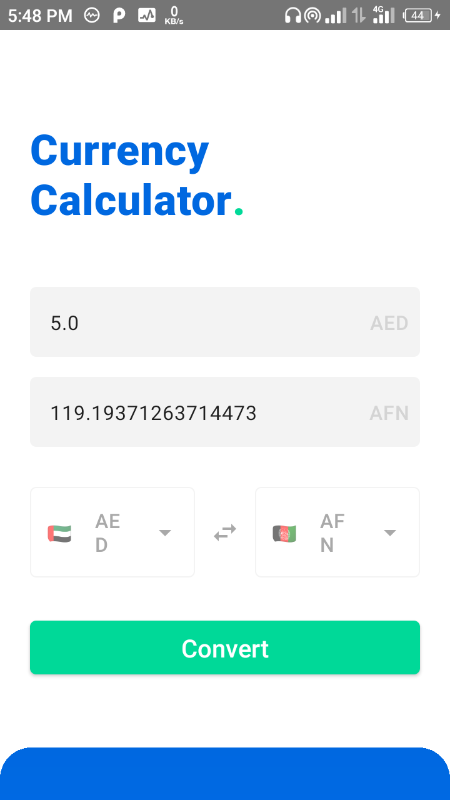
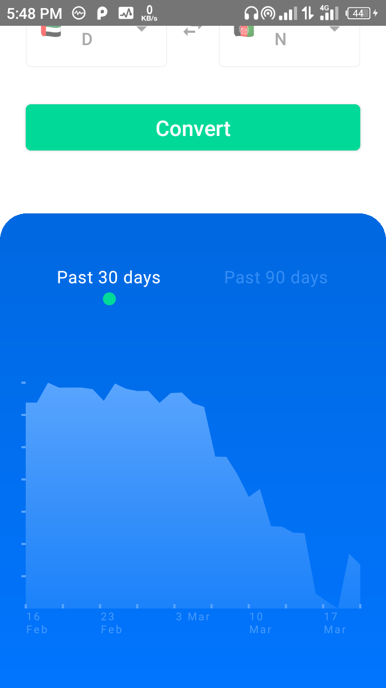
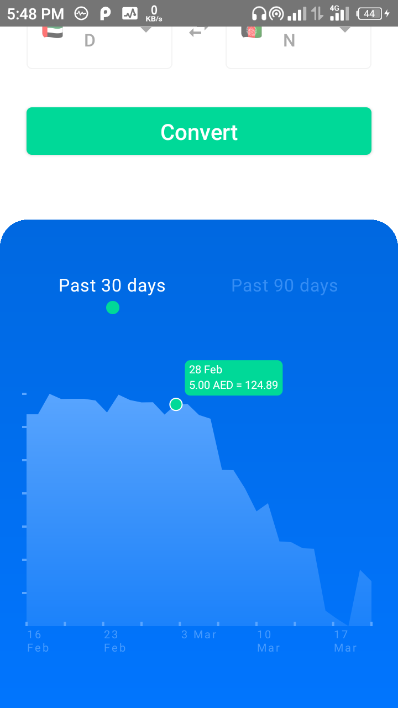
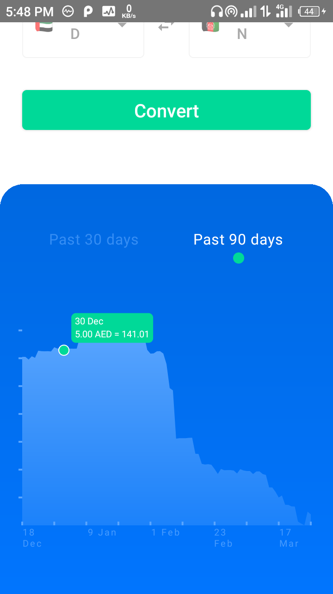
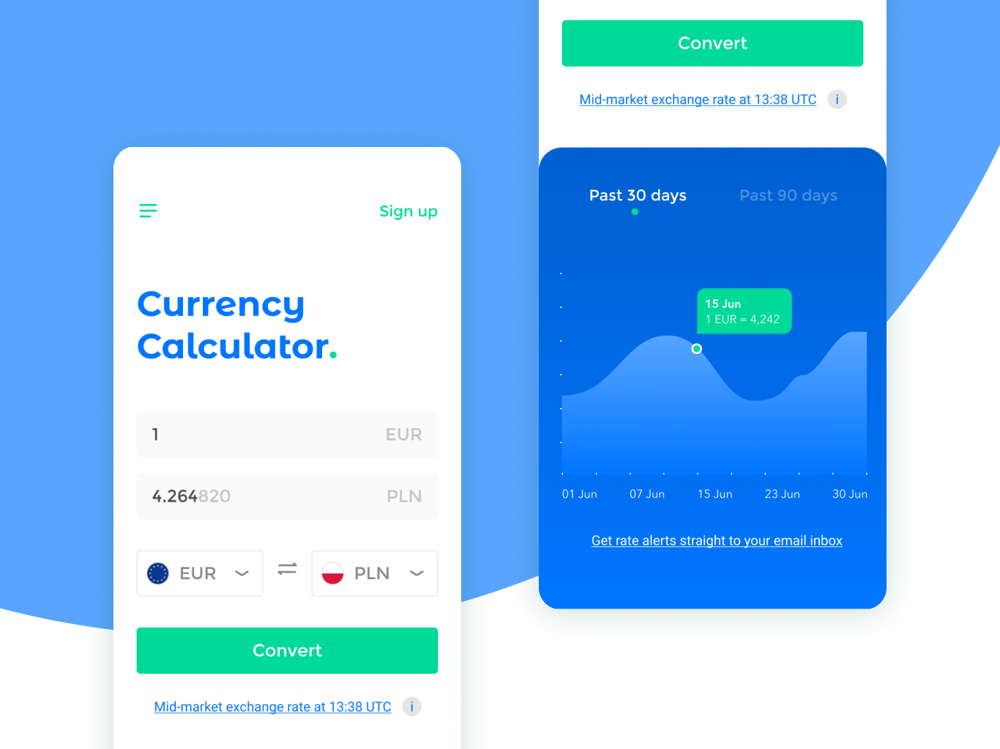

# Currency Calculator
A simple app implemented with jetpack compose ui that converts one currency
to another and displays a graph showing the trend of the output currency in relation to the input currency

## Screenshots

## Known Bugs (mostly UI related)
- Date of last fetch from server is not showing due to the way I am initializing the date data in the model class
- When on the last 90 days graph view, days after the first thirty can not show popup because of the way compose saves
scopes to handle less work during recomposition, because of that, the scope monitoring the clicking is still referencing
the chart data with the last 30 days, I'll have to ask the gods at stackoverflow.com for help on this one.

### Based On
https://dribbble.com/shots/6647815-Calculator

